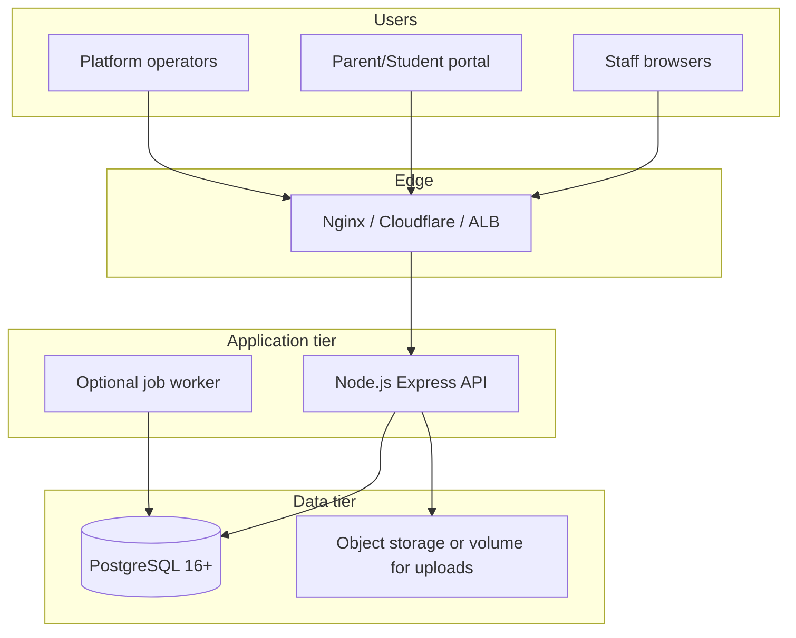

# School OS — Hosting & Deployment Plan

This document is the operational plan for running School OS in production.

## Architecture overview



| Component | Responsibility |
|-----------|----------------|
| **React SPA** | Staff UI, portal, platform console (static files) |
| **Express API** | Auth, tenancy, RBAC, all modules, PDF generation |
| **PostgreSQL** | Single source of truth; all tenant data scoped by `tenant_id` |
| **Job queue** | In-process by default; campaigns processed every 5s in API process |
| **Uploads** | Local `uploads/` directory (map to persistent volume or S3 adapter later) |

---

## Environment variables

| Variable | Required | Description |
|----------|----------|-------------|
| `DATABASE_URL` | Yes | PostgreSQL connection string |
| `SESSION_SECRET` | Yes | Long random string for session signing |
| `NODE_ENV` | Yes | `production` in deploy |
| `PORT` | No | Default `5000` |
| `CLIENT_ORIGIN` | Prod | Public URL (e.g. `https://app.yourschool.com`) for CORS |
| `MESSAGING_PROVIDER` | No | `console` (default) or `stub` |
| `MESSAGING_API_KEY` | No | External SMS/email provider key when implemented |

Copy `server/.env.example` and set secrets in your host or secrets manager (never commit `.env`).

---

## Database migrations

### Incremental (recommended for upgrades)

Tracks applied migrations in Drizzle’s `__drizzle_migrations` table:

```bash
npm run db:migrate
npm run db:seed   # demo data; skip in production or use a trimmed seed
```

Migration files (in order):

1. `0000_motionless_glorian.sql` — core tenancy, users, students, admissions, attendance, jobs
2. `0001_student_documents.sql` — student documents
3. `0002_phases_6_10.sql` — academics, exams, finance, HR, payroll, operations
4. `0003_phases_11_15.sql` — messaging, portal, platform SaaS tables

### Full schema (greenfield only)

For a **new empty database** without migration history:

```bash
npm run db:build-full-migration   # generates server/src/db/migrations/full_schema.sql
psql "$DATABASE_URL" -f server/src/db/migrations/full_schema.sql
```

Then run seed once if you need demo tenants.

---

## Deployment options

### Option A — Docker Compose (staging / small prod)

```bash
export SESSION_SECRET=$(openssl rand -hex 32)
docker compose up -d --build
```

- App: http://localhost:5000 (API serves built React + API)
- Postgres: port 5432 (restrict in production)

### Option B — PaaS (Railway, Render, Fly.io)

1. Provision **PostgreSQL** add-on; set `DATABASE_URL`.
2. Deploy **server** from repo root using `Dockerfile` or:
   - Build command: `npm run build`
   - Start command: `cd server && npm run db:migrate && node dist/index.js`
3. Set env vars above; enable HTTPS (required for `Secure` cookies in production).
4. Attach persistent disk for `uploads/` or plan S3 migration.

### Option C — VPS (Ubuntu + Nginx + PM2)

1. Install Node 20, PostgreSQL 16, Nginx.
2. Clone repo, `npm install`, `npm run build`.
3. Run migrations: `npm run db:migrate`.
4. PM2: `pm2 start server/dist/index.js --name school-os`.
5. Nginx reverse proxy to `127.0.0.1:5000`, TLS via Certbot.
6. Cron optional: separate worker process calling job tick if you split queue later.

**Nginx snippet (TLS termination):**

```nginx
server {
  listen 443 ssl;
  server_name app.example.com;
  location / {
    proxy_pass http://127.0.0.1:5000;
    proxy_http_version 1.1;
    proxy_set_header Host $host;
    proxy_set_header X-Real-IP $remote_addr;
    proxy_set_header X-Forwarded-For $proxy_add_x_forwarded_for;
    proxy_set_header X-Forwarded-Proto $scheme;
  }
}
```

---

## Production checklist

- [ ] Strong `SESSION_SECRET` and database credentials in secrets manager
- [ ] `NODE_ENV=production`, `CLIENT_ORIGIN` matches public URL
- [ ] HTTPS everywhere (cookies are `httpOnly`; use `Secure` behind TLS — configure in auth if needed)
- [ ] Run `npm run db:migrate` on each release before starting new containers
- [ ] Backups: daily PostgreSQL snapshots + `uploads/` volume
- [ ] Rate limiting enabled (120 req/min per IP+path prefix)
- [ ] Remove or gate `db:seed` demo accounts in production
- [ ] Monitoring: health `GET /api/health`, logs aggregation, DB connection alerts
- [ ] Scale: single API instance OK to ~few hundred concurrent users; add read replicas / worker later

---

## URLs after deploy

| Audience | Path |
|----------|------|
| Home | `/` |
| Staff login | `/s/{slug}/login` |
| Parent/student | `/s/{slug}/portal/login` |
| Platform | `/platform/login` |

---

## Release procedure

1. Merge to `main`, tag release.
2. CI: `npm run check && npm run test && npm run build`.
3. Build container or artifact.
4. Run migrations against production DB.
5. Rolling deploy API; verify `/api/health`.
6. Smoke test: staff login, create student, record payment, download PDF.

---

## Future scaling (not required for v1)

- Dedicated **worker** service for `campaign.send` jobs
- **Redis** for rate limits and session store
- **S3** for document storage
- **Read replica** for reporting queries
- Multi-region DR with Postgres replication
