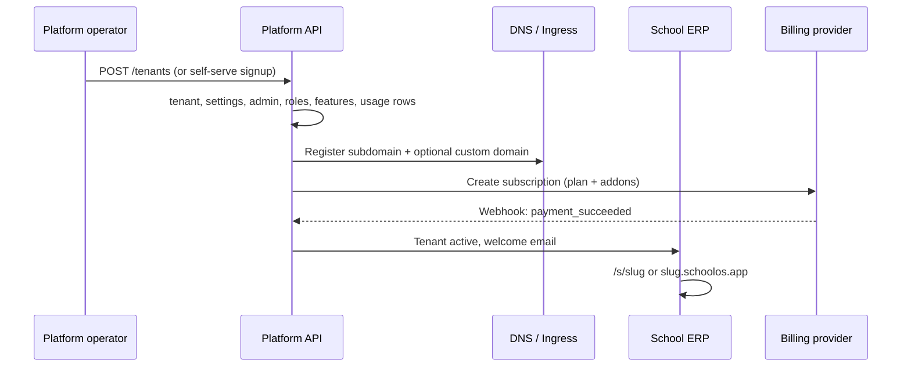

# SchoolOS — Enterprise SaaS Ecosystem Blueprint

This document captures the **expanded product architecture** (Antigravity / platform vision) and maps it to **what exists today** vs **what is scaffolded** vs **what remains to build**.

`docs/ARCHITECTURE.md` remains the source of truth for **security domains**, **tenant isolation**, and **Phases 1–15** (school ERP). This file is the **SaaS platform & ecosystem roadmap**.

---

## Positioning

SchoolOS targets a **modern, modular, AI-native** education stack — comparable in ambition to:

| Category | Examples | SchoolOS angle |
|----------|----------|----------------|
| K–12 / SIS | PowerSchool, Fedena | Strong tenant ERP + portal; lighter SIS depth today |
| Independent / private | Blackbaud | Finance, admissions, communications |
| Modular ERP | Odoo Education | Per-module permissions + feature flags |
| SaaS operations | Stripe, Shopify, Vercel | Auto-provision, domains, plans, usage meters |

**Differentiators:** relational feature flags, OBAC portal, geo plan pricing, East Africa–first defaults (UGX/KES), and room for AI add-ons without mixing platform and school auth.

---

## Architecture pillars (blueprint)

### 1. Provisioning & routing (Shopify / Vercel style)

| Capability | Target behaviour | Status |
|------------|------------------|--------|
| Automatic school provisioning | Platform creates tenant + settings + admin + RBAC + default features | **Shipped** — `POST /api/platform/tenants` |
| Auto-generated subdomains | `{slug}.schoolos.app` (or operator domain) | **Shipped** — `tenants.subdomain`; `USE_SUBDOMAIN` + `PLATFORM_DOMAIN`; host middleware |
| Custom domain connection | School maps `erp.stmarys.ac.ug` | **Shipped** — platform API + tenant detail UI |
| Domain verification & SSL | HTTP-01 / CNAME challenge, cert lifecycle | **Partial** — DNS TXT instructions + manual verify; no automated ACME worker |
| SaaS-grade provision flow | Signup → plan → payment → tenant live → welcome email | **Partial** — manual platform provision; no self-serve checkout |

**Today’s URLs:** path-based `/s/{slug}/…` (production: `https://school.bclimaxtech.com/s/school-a/…`). Subdomain/custom domain is a **Phase 16+** routing layer in front of the same app.

### 2. Modular pricing & monetization (Stripe style)

| Capability | Status |
|------------|--------|
| Base plans (`starter`, `pro`) + `features_json` enforcement | **Shipped** |
| Geo/regional plan prices (`plan_regional_prices`) | **Shipped** |
| Platform display currency + FX consolidation | **Shipped** (Frankfurter) |
| Feature marketplace / add-ons | **Shipped** — catalog + per-tenant activate/deactivate; merged in `plan-features` |
| Usage-based billing meters | **Shipped** — meters, thresholds, overage lines; SMS gated in campaign worker |
| Enterprise / consortium plans | **Planned** — catalog + custom contracts |
| Stripe (or local) payment webhooks | **Planned** |

### 3. Dynamic feature access

| Layer | Status |
|-------|--------|
| Global catalog `features` + per-tenant `tenant_features` | **Shipped** |
| Plan ∩ tenant feature enforcement (`plan-features`, `requireTenantFeature`) | **Shipped** |
| Add-on features merged into access checks | **Shipped** — `isAddonFeatureAllowed` in `plan-features` |
| Usage caps (block SMS when over quota) | **Shipped** — `checkUsageAllowed` in campaign worker |

### 4. White-label & multi-campus

| Capability | Status |
|------------|--------|
| Branding JSON (logo text, footer) on tenant settings | **Shipped** |
| Full white-label (custom domain, SMTP, assets CDN) | **Scaffolded** — add-on row; no SMTP/domain UI |
| Multi-campus (branches under one school tenant) | **Scaffolded** — `tenant_campuses`; ERP rows not scoped by `campus_id` yet |

### 5. Platform command center (operator / “SaaS emperor”)

| Hub | Status |
|-----|--------|
| Command Center (macro metrics, FX revenue) | **Shipped** (Phase 16 UI) |
| Schools — provision, flags, locale | **Shipped** |
| Plans & FX | **Shipped** |
| Revenue ledger | **Partial** — stats; per-tenant usage lines on tenant detail |
| Support / tickets | **Planned** |
| Impersonation (read-only shadow) | **Shipped** — token exchange + read-only writes blocked |
| Global audit stream | **Shipped** — school + platform combined feed |
| Job queue monitor | **Shipped** (basic) |

### 6. School ERP (tenant layer)

Phases **1–15** in `ARCHITECTURE.md`: students, finance, exams, HR, payroll, admissions, messaging, portal PDFs, etc.

**Terminology:** tenant = **school**; **employees** (teachers, headteachers, secretaries) live in HR; **school administrators** use ERP login (`users`).

### 7. AI-native education

| Feature | Status |
|---------|--------|
| AI homework / grading add-on (catalog) | **Scaffolded** — `addon_features.ai_homework` |
| AI credits usage meter | **Scaffolded** — `tenant_billing_usage.ai_credits` |
| Timetable AI, at-risk alerts, chatbot | **Planned** |

### 8. Mobile app ecosystem

| Surface | Status |
|---------|--------|
| Responsive web (staff + portal) | **Shipped** |
| Native iOS/Android (staff, parent, teacher) | **Planned** — API-first; same cookies or token auth TBD |

---

## Target provisioning flow (north star)

---

## Competitive module map (ERP structure)

| Module | SchoolOS today | Notes vs incumbents |
|--------|----------------|---------------------|
| SIS / students | Strong | CSV, guardians, documents |
| Admissions | Strong | Pipeline, enroll, docs |
| Attendance | Yes | |
| Academics / timetable | Partial | Classes, years; not full scheduler |
| Exams / gradebook | Strong | Marks, report cards, PDF |
| Finance / fees | Strong | Invoices, payments; not full GL |
| HR / payroll | Strong | Employees, leave, contracts, payslips |
| Library, health, transport, boarding | Module pages | Ops modules |
| Communications | Campaigns, announcements | Not full CRM |
| Parent/student portal | Yes | OBAC, fee gates |
| Analytics / BI | Basic dashboard | Not PowerSchool-level analytics |
| Platform billing | Scaffolded | Usage + addons tables |

---

## Implementation phases (proposed 16+)

| Phase | Theme | Deliverables |
|-------|--------|--------------|
| **16** | Domains & routing | Formal migration for ecosystem tables; subdomain resolve by DB; custom domain UI + verify job |
| **17** | Platform ops | Impersonation router, global audit API, tenant detail page |
| **18** | Add-on marketplace | Purchase/enable addons; merge into `requireTenantFeature`; platform UI |
| **19** | Usage billing | Increment meters (SMS, storage); thresholds; invoice line items |
| **20** | Self-serve signup | Public plan picker → payment → auto-provision |
| **21** | Multi-campus | `campus_id` on students/classes; campus switcher |
| **22** | White-label | SMTP settings, theme upload, custom domain SSL automation |
| **23** | Enterprise tier | Consortium plan, SLA flags, dedicated support hub |
| **24** | AI v1 | Homework assist API behind add-on + credit meter |
| **25** | Mobile | Parent app MVP (React Native) on portal API |

Phases 1–15 remain **frozen** as delivered school ERP scope in `ARCHITECTURE.md`.

---

## Schema already scaffolded (boot + Drizzle)

These exist in `server/src/db/schema.ts` and are ensured at startup via `ensureRuntimeSchema` (VPS-safe). A formal Drizzle migration (`0010_saas_ecosystem.sql`) should be added before relying on them in production.

- `tenants`: `subdomain`, `custom_domain`, `domain_verified`, `ssl_config`
- `tenant_campuses`
- `addon_features`, `tenant_addons`
- `tenant_billing_usage`
- `plan_regional_prices`, `platform_settings` (see geo pricing doc)

---

## Related docs

- [ARCHITECTURE.md](./ARCHITECTURE.md) — security, RBAC, phases 1–15
- [DEMO.md](./DEMO.md) — logins and URLs
- [HOSTING.md](./HOSTING.md) / [CWP-SCHOOL-BCLIMax.md](./CWP-SCHOOL-BCLIMax.md) — deployment (today: single domain + path routing)
