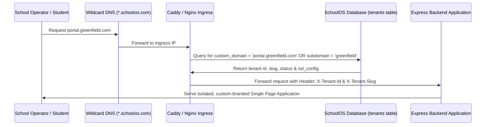
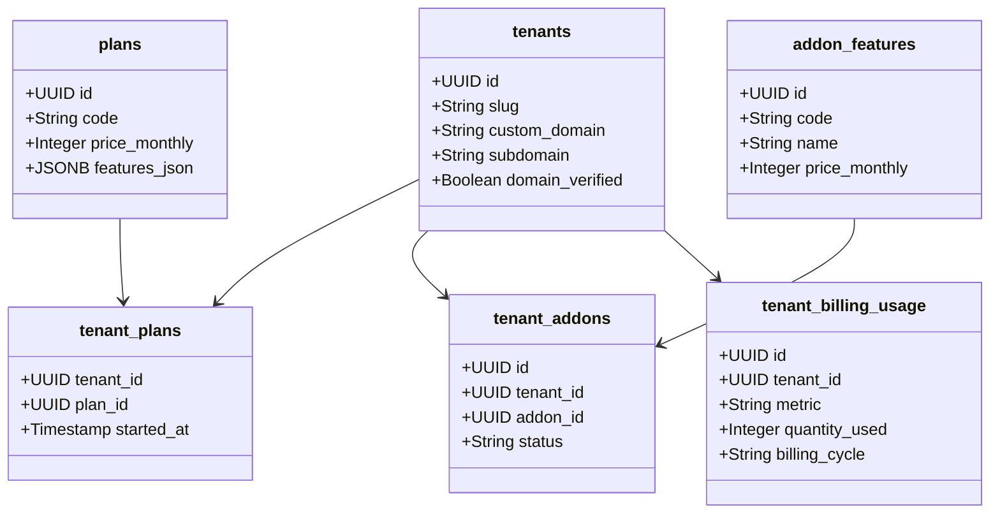

# SchoolOS Enterprise SaaS Architecture Blueprint

This document defines the system topology, competitive analysis, and implementation roadmap for scaling **SchoolOS** into a modern, multi-tenant enterprise educational SaaS platform comparable to Shopify/Vercel for schools.

---

## 1. Competitive Analysis & Industry Positioning

Existing legacy school ERP platforms rely on monolithic, dated architectures that introduce severe tenant leakage risks, complex configuration chains, and a lack of native intelligence.

| Feature / Metric | PowerSchool / Blackbaud | Fedena / Odoo Education | **SchoolOS Enterprise** |
| :--- | :--- | :--- | :--- |
| **System Architecture** | Monolithic legacy database structures, often single-tenant VMs per client. | Monolithic plugins (Odoo) or Ruby-on-Rails MVC (Fedena). | **Cloud-native Serverless-ready PostgreSQL with strict Tenant-RLS Isolation.** |
| **Domain Provisioning** | Manual sysadmin setup taking days/weeks per school node. | Semi-automated subdomains with manual database seeding. | **Instant automated provisioning, dynamic subdomain routing, and automated Let's Encrypt SSL connections.** |
| **Auth & Security Model** | Giant collapsed RBAC tables. Vulnerable to IDOR permission leaks. | Plugin-level security hooks. Vulnerable to cross-tenant escalations. | **Three Autonomous Security Worlds** (Platform SaaS vs Tenant ERP with RLS vs Portal-only ownership filters). |
| **Feature Customization** | Locked core packages. Upgrades require enterprise sales calls. | Code-level plugins that make upgrading the core system highly fragile. | **Dynamic Relational Feature Flagging & Marketplace Add-on Engine.** |
| **Billing Model** | Flat annual subscription contracts per seat. | Flat-rate or basic tier billing. | **Modular Regional Pricing + Metered Usage-Based Billing** (SMS, AI, storage bytes). |
| **AI Intelligence** | Absent or limited to third-party dashboards integrations. | Manual reporting scripts. | **Native AI Agents** (Auto-grading assistant, predictive dropout analytics, semantic search). |

---

## 2. Dynamic Domain Routing & Let's Encrypt SSL Pipeline

To allow instant school setup under custom subdomains (e.g. `greenfield.schoolos.com`) or white-labeled domains (e.g. `portal.greenfieldacademy.edu`), SchoolOS leverages a dynamic ingress pipeline.

### Dynamic DNS Wildcard Routing


### Automated SSL Generation & Verification Workflow
When a school connects a custom domain in their settings:
1. **CNAME Mapping**: The school creates a DNS `CNAME` pointing `portal.schoolname.edu` to `ingress.schoolos.com`.
2. **Platform Verification**: SchoolOS initiates an automated HTTP challenge request:
   ```typescript
   // Ingress endpoint for ACME SSL Challenge
   router.get("/.well-known/acme-challenge/:token", (req, res) => {
     const challengeValue = getAcmeToken(req.params.token);
     res.send(challengeValue);
   });
   ```
3. **Automated Certificates**: The dynamic reverse proxy (e.g., Caddy via `on_demand_tls` or a background cron worker leveraging Let's Encrypt APIs) intercepts new handshakes, checks `tenants.custom_domain`, and automatically provisions, signs, and renews a free TLS/SSL certificate.

---

## 3. Modular Pricing & Usage-Based Billing Ledger

Rather than collapsing all capabilities, SchoolOS enforces two billing layers:
1. **Modular Subscriptions**: Set relationally inside `tenant_plans` mapped against geographic price models in `plan_regional_prices` (handling ugx, kes, usd on-the-fly).
2. **Usage-Based Ledger**: Meted in real-time inside the `tenant_billing_usage` schema.



### Metered Usage Counters
Usage metrics are tracked monthly inside `tenant_billing_usage`:
- **`sms_volume`**: Incremented by 1 per custom campaign text message sent.
- **`ai_credits`**: Incremented by 1 per homework auto-grading or transcript parsing execution.
- **`storage_bytes`**: Aggregated daily representing disk file allocations under `/uploads/{tenant_id}/`.

---

## 4. Dynamic Feature Access Middleware

A unified express-level middleware checks feature modules on-the-fly based on both the global subscription plan features and purchased marketplace add-ons.

```typescript
import { Request, Response, NextFunction } from "express";
import { isFeatureAllowedForTenant } from "../services/plan-features";
import { ForbiddenError } from "../middleware/error";

/**
 * Express middleware to restrict routes to specific modular capabilities
 * (e.g., transport, inventory, AI assistance, boarding).
 */
export function requireTenantFeature(featureCode: string) {
  return async (req: Request, res: Response, next: NextFunction) => {
    try {
      const tenant = (req as any).tenant;
      if (!tenant) return next(new ForbiddenError("Tenant context missing"));
      
      const enabled = await isFeatureAllowedForTenant(tenant.id, featureCode);
      if (!enabled) {
        return next(
          new ForbiddenError(`The module '${featureCode}' is disabled or not subscribed under your school's plan.`)
        );
      }
      next();
    } catch (err) {
      next(err);
    }
  };
}
```

---

## 5. Multi-Campus Node Isolation Topology

Large institutional networks (e.g. multi-campus academies in East Africa) require high-level aggregated operational records while keeping day-to-day student rosters completely isolated.

### Schema Implementation: `tenant_campuses`
- Each geographical branch (e.g., Kampala Campus, Jinja Campus) maps as a node under `tenant_campuses`.
- Operational records (such as `students`, `staff`, `classes`, and `payments`) have a nullable `campus_id` reference:
  ```sql
  ALTER TABLE "students" ADD COLUMN "campus_id" uuid REFERENCES "tenant_campuses"("id") ON DELETE SET NULL;
  ```
- **Cross-Campus Security Rules**:
  - **Campus Operator**: Mapped to a single campus. RLS query: `WHERE tenant_id = ctx.tenantId AND campus_id = ctx.campusId`.
  - **Network Administrator**: Full visibility. RLS query: `WHERE tenant_id = ctx.tenantId`. Bypasses campus filtration but remains locked inside the tenant boundary.

---

## 6. AI-Native Education Features

SchoolOS integrates Gemini-powered AI features directly inside the school workflow:

1. **AI Homework Assistant (`ai_homework` Add-on)**:
   - Instructors upload student submissions (images, text docs).
   - The system executes Gemini to parse, cross-reference the grading rubric, assign points, and auto-generate draft written feedback for teacher approval.
2. **Predictive Dropout Analysis**:
   - Background statistics gather attendance indices, assessment marks fluctuations, and fee payment delays.
   - An in-memory machine learning scorer flags students with elevated dropout risk levels, enabling timely guidance counselor interventions.
3. **AI Campaign Builder**:
   - Generates persuasive SMS/Email fee payment alerts tailored to parent demographics and previous transaction cycles.
